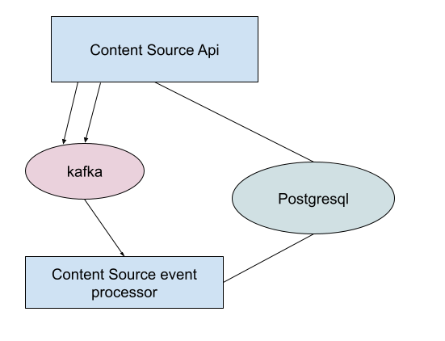

# Content Sources

Content Sources provides a central location for users to define yum repositories, learn about the contents of those yum repositories, and for other applications to be able to reuse this information.  [Image Builder](https://github.com/osbuild/image-builder), for example, supports using repositories defined in Content Sources for building images.

# Architecture

Version: 1.0

Note: this document is targeting the desired architecture for the first milestone (May 2023).  It will be updated as needed.

This application consists of these parts:
* Rest Api
  * Used for our frontend or for other applications to interact with ours
* Postgresql Database
  * Used for storing our data ([database model](https://www.plantuml.com/plantuml/proxy?cache=no&src=https://raw.githubusercontent.com/content-services/content-sources-backend/main/docs/db-model.puml))
* Kafka Platform
  * Used to push messages for the event listener and other applications that want information around content sources.  These messages could include Repository creation, update, deletion, etc.
* Event listener
  * Will listen for messages via kafka to do background processing tasks.  The results of which are stored in the Postgresql database.
  * For example, at Repository creation or update time, the listener will fetch metadata from the yum repository and introspect it to learn about its packages.

## Deployments

When deploying within kubernetes, we recommend:
 * Minimum 3 pods for the API
   * Each pod consumes about 30 MB of memory
 * Minimum 3 pods for the Event Listener (kafka consumer)
   * Each pod consumes about 35 MB of memory

## Data Loss
 * Database: If the database is lost, all user data is lost and must be restored from backup.
 * Kafka: If the contents of the kafka queue are lost, a newly created repository will show as 'Pending' and introspection will be delayed until the introspection cron job runs (currently every eight hours).

## External Dependencies
 * RBAC
   * https://github.com/RedHatInsights/insights-rbac
   * If unavailable, user actions cannot be performed
 * Database
   * If unavailable, user actions cannot be performed, no introspections can take place
 * Kafka broker
   * If unavailable, introspections will not occur when repositories are first created

## Routes
All routes are based off the same root (/api/content-sources/v1/) and can be viewed via our api specification, available [here](https://redocly.github.io/redoc/?url=https://raw.githubusercontent.com/content-services/content-sources-backend/main/api/openapi.json)
