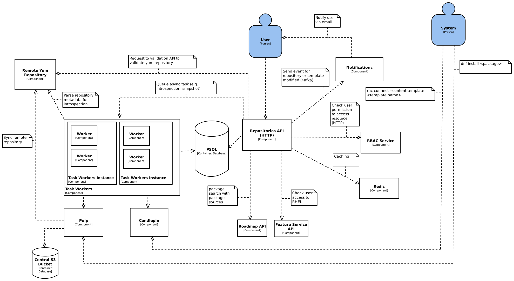

# Content Sources

Content Sources provides a central location for users to define yum repositories, learn about the contents of those yum repositories, and for other applications to be able to reuse this information.  [Image Builder](https://github.com/osbuild/image-builder), for example, supports using repositories defined in Content Sources for building images.

# Architecture

Version: 2.0

Note: this document is targeting the desired architecture for content-sources with snapshotting. 

This application consists of these parts:
* Rest Api
  * Used for our frontend or for other applications to interact with ours
* Postgresql Database
  * Used for storing our data ([database model](https://www.plantuml.com/plantuml/proxy?cache=no&src=https://raw.githubusercontent.com/content-services/content-sources-backend/main/docs/db-model.puml))
* Kafka Platform
  * Used to push messages for notification purposes.  This is no longer used for tasking.
* Task Worker
  * Pull tasks from the database and executes them  
  * For example, at Repository creation or update time, the worker will fetch metadata from the yum repository and introspect it to learn about its packages.
* Redis cache
  * Used to cache rbac requeests to decrease latency
* Pulp Server
  * Used for creating snapshots of repositories
  * Consists of a database, api server, content server, and workers
  * (Pulp's Architecture)[https://docs.pulpproject.org/pulpcore/components.html]

## Deployments

When deploying within kubernetes, we recommend:
 * Minimum 3 pods for the API
   * Each pod consumes about 30 MB of memory
 * Minimum 3 pods for the Task Worker
   * Each pod consumes about 35 MB of memory

## Data Loss
 * Database: If the database is lost, all user data is lost and must be restored from backup.
 * Kafka: If the contents of the kafka queue are lost, a newly created repository will show as 'Pending' and introspection will be delayed until the introspection cron job runs (currently every eight hours).
 * redis: If the content are lost, latency will be higher temporarily until a good cache is built back.
 * Pulp Server: If the pulp database is lost, it must be restored from backup.
 
## External Dependencies
 * RBAC
   * https://github.com/RedHatInsights/insights-rbac
   * If unavailable, user actions cannot be performed
 * Database
   * If unavailable, user actions cannot be performed, no introspections can take place
 * Redis
   * If unavailable, requests to the api will have a higher latency
 * Kafka broker
   * If unavailable, no notifications can be sent
 * Pulp
   * If unavailable, no snapshots can take place, content cannot be served
   
## Routes
All routes are based off the same root (/api/content-sources/v1/) and can be viewed via our api specification, available [here](https://redocly.github.io/redoc/?url=https://raw.githubusercontent.com/content-services/content-sources-backend/main/api/openapi.json)
