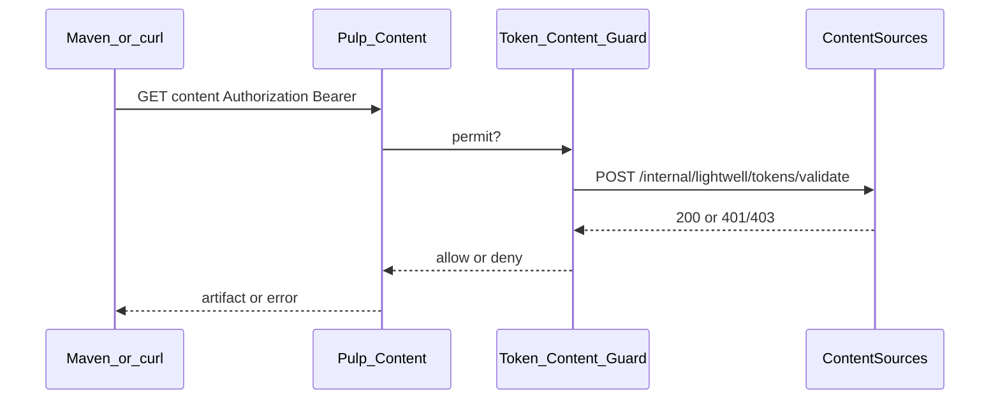

# Handoff: Lightwell Pulp content guard

Audience: an agent / team implementing download enforcement in **pulp_service** (or a Pulp plugin/gateway), plus a later small Content Sources follow-up to attach the guard.

Content Sources already owns:

- Token create / list / revoke (public API under `/api/content-sources/`)
- Bearer auth for CS package/repo APIs
- Cluster-local validate API for Pulp callbacks

Canonical validate contract: [lightwell_token_pulp_contract.md](lightwell_token_pulp_contract.md).

Related:

- API types: [pkg/api/lightwell_tokens.go](../pkg/api/lightwell_tokens.go)
- Smoke (Phase B when guarded): [scripts/smoke_lightwell_tokens.sh](../scripts/smoke_lightwell_tokens.sh)
- Frontend token UI handoff: [lightwell_tokens_frontend_handoff.md](lightwell_tokens_frontend_handoff.md)
- Local compose Pulp image: [compose_files/pulp/docker-compose.yml](../compose_files/pulp/docker-compose.yml)

## Demo contribution

Full E2E demo needs Lightwell content URLs to **deny** unauthenticated downloads and **allow** `Authorization: Bearer <token>`, with revoke and entitlement loss applying quickly. Until the guard is attached, content remains open (current behavior).

## Validate contract (hard rules)

Do **not** fork this shape; see [lightwell_token_pulp_contract.md](lightwell_token_pulp_contract.md) for full detail.

| Item | Requirement |
|------|-------------|
| Method / path | `POST /internal/lightwell/tokens/validate` |
| Host | **In-cluster** Content Sources service only (example: `http://content-sources-backend-service:8000/...`). Never `console.redhat.com`. |
| Not public | Outside `/api/content-sources/`; absent from public OpenAPI; not on 3scale. |
| Auth | Header `X-Rh-Cs-Internal-Token` must equal CS config `options.lightwell_validate_secret` |
| Body | `{ "token": "<raw bearer token>", "path": "/request/path" }` — **path required** for content downloads |
| Success | **200** `{ "org_id", "user_id", "token_uuid", "access_level" }` |
| Failure | **401** bad/missing token or secret; **403** missing `lightwell-network` entitlement or insufficient `access_level` for path |
| Entitlement | Re-checked on **every** validate call |
| Access level | `validated` tokens may access validated+remediated; `remediated` tokens may access remediated only |
| Cache | Prefer no positive cache; if any, seconds-scale only and documented |

## Pulp work (primary — this handoff)

Local Pulp is **not** bare upstream pulpcore. Compose runs `quay.io/redhat-services-prod/pulp-services-tenant/pulp:latest` with `pulp_service` (already has guards such as `ServiceFeatureContentGuard`). Lightwell maven/python distributions are created **without** `content_guard` today ([scripts/create_lightwell_repo.sh](../scripts/create_lightwell_repo.sh)).

### Required behavior

1. Add a content guard type usable on Lightwell domain maven/python distributions.
2. On each content request:
   - Read `Authorization: Bearer <token>`
   - Also accept HTTP Basic with the token as the **password** if needed for Maven tooling
3. Call CS validate with the shared secret **and the content request path**; deny the download if CS returns non-2xx.
4. Configure: CS base URL (cluster-local) + shared secret matching `options.lightwell_validate_secret`.

### Local verification

After guard is attached to a distribution:

```bash
EXPECT_PULP_GUARDED=1 \
  CONTENT_URL='http://localhost:8081/api/pulp-content/...' \
  REPO_UUID=... \
  ./scripts/smoke_lightwell_tokens.sh
```

Expect: no-auth content → 401/403; Bearer good token → 200; after revoke → deny.

With `EXPECT_PULP_GUARDED=0` (default), open content **200** is still expected and documented as “Pulp still open.”

## CS follow-up after guard API exists (secondary)

Do **after** pulp_service exposes CRUD for the new guard type. Not part of the Pulp-only PR unless the same agent owns both repos.

1. Extend [pkg/clients/pulp_client/content_guard.go](../pkg/clients/pulp_client/content_guard.go) and maven/python distribution update helpers to create/attach the token guard.
2. Teach Lightwell importer and [scripts/create_lightwell_repo.sh](../scripts/create_lightwell_repo.sh) to set `content_guard` on Lightwell dists.
3. Fix [pkg/tasks/helpers/pulp_distribution_helper.go](../pkg/tasks/helpers/pulp_distribution_helper.go) so Lightwell org/domain is **not** incorrectly handled via `CreateOrUpdateGuardsForOrg` / RHEL feature-guard paths (plan note: avoid treating Lightwell like org `"-3"` guard wiring).

## Rollout order

1. **Done (CS):** token CRUD + Bearer API auth + cluster-local validate.
2. **Pulp:** deploy content guard implementation.
3. **CS attach:** set `content_guard` on Lightwell distributions (client + seed scripts).
4. **Demo / CI:** run smoke Phase B with `EXPECT_PULP_GUARDED=1`; treat open downloads as failure.



## Out of scope for the Pulp agent

- Console / Lightwell UI for token management ([frontend handoff](lightwell_tokens_frontend_handoff.md)).
- CS token CRUD, Bearer middleware, or migrations (already implemented).
- Demo-org (`lightwell-network-demo`) PAT path unless product asks later.
