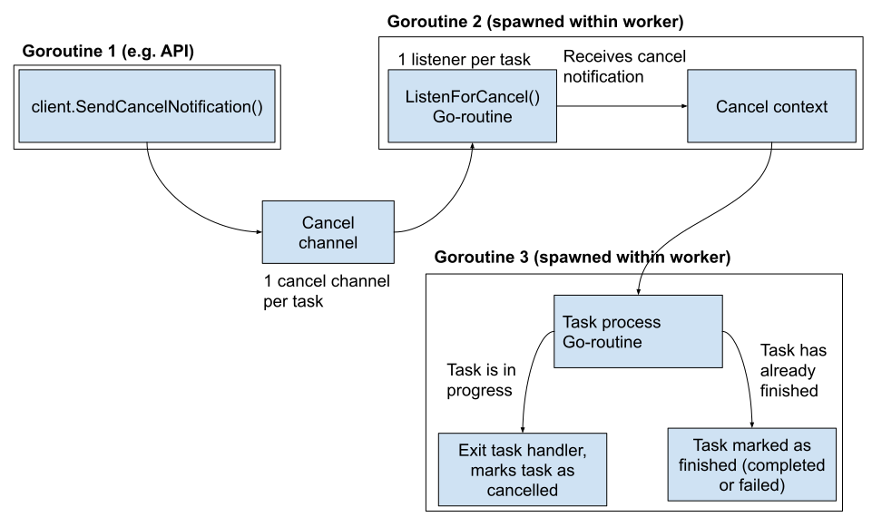

#  Tasking System
The tasking system enables our app to complete actions, i.e. tasks, asynchronously from the backend API.
For example, when creating a repository, a “snapshot” task is triggered, and begins to run in parallel to the API server.

For a detailed overview of the tasking system see [this video](https://drive.google.com/file/d/1clTBLDOhPaTmxEd2PUuvmuHYu2oP6Yp1/view) and the [accompanying slide deck](https://docs.google.com/presentation/d/19nzcEvXNS1OzwRmGJ7tPdeiJS2LAbjwMi0YBH-yU-eE/edit#slide=id.p).

## Features 
* Queue and process asynchronous tasks
* Check the status of queued tasks
* Requeue a task if its worker times-out or exits early, with a backoff timer
* Schedule dependent tasks
* Cancel a task
* Set a task's priority

## Directory structure

| Package            | Description                                                                                     |
|--------------------|-------------------------------------------------------------------------------------------------|
| pkg/tasks          | each file contains code for handling a particular task type                                     |
| pkg/tasks/queue    | queue used by client and worker to schedule tasks                                               |
| pkg/tasks/client   | an interface to enqueue a task                                                                  |
| pkg/tasks/worker   | an interface to dequeue and handle tasks                                                        |
| pkg/tasks/payloads | workaround to import certain payloads to dao layer, but payloads are not generally defined here |

## Concepts

### Queue

`Queue` is an interface used by the client and worker packages for scheduling tasks. It is meant to be used through client or worker, not imported independently.

https://github.com/content-services/content-sources-backend/blob/173f764d031da46665136a317caa8213e3677ad7/pkg/tasks/queue/queue.go#L28-L53

### Client

`TaskClient` is an interface for enqueuing or canceling tasks.

https://github.com/content-services/content-sources-backend/blob/173f764d031da46665136a317caa8213e3677ad7/pkg/tasks/client/client.go#L12-L15
### Worker Pool

`TaskWorkerPool` is an interface used by the main application to configure and start the workers and the heartbeat listener.

https://github.com/content-services/content-sources-backend/blob/173f764d031da46665136a317caa8213e3677ad7/pkg/tasks/worker/worker_pool.go#L17-L28
A worker pool will manage the individual workers. Workers are meant to be used through the `TaskWorkerPool` interface, not directly.

Each worker is a goroutine that follows the logic loop below:

### Task Cancellation
Tasks can be cancelled. The worker pool listens on a Postgres channel for UUIDs of cancelled tasks, which the client sends as notifications that the worker pool receives and uses to cancel the tasks.

## Deployment

The tasking system runs in two different processes, the API and the consumer.

The API is the main API server, where tasks are enqueued from endpoint handlers.

The consumer runs two sets of goroutines: the workers and the heartbeat listener.

## How to add a new task type

To add a new task you must define a handler method. Each handler method should end with a `Run()` method that performs the task. Tasks should be written to be idempotent i.e. they can be re-run without causing errors.

Here is the snapshot handler as an example:

https://github.com/content-services/content-sources-backend/blob/173f764d031da46665136a317caa8213e3677ad7/pkg/tasks/repository_snapshot.go#L27-L53

To make a task cancellable, it must be added to the [list of cancellable tasks](https://github.com/content-services/content-sources-backend/blob/1116db3eb97704714fc2cc896b730bf71958b8cc/pkg/config/tasks.go#L22). If a cleanup action is required to support cancellation, this should be implemented as a defer call in the `Run()` method. See how the snapshot task does cancellation cleanup here:

https://github.com/content-services/content-sources-backend/blob/173f764d031da46665136a317caa8213e3677ad7/pkg/tasks/repository_snapshot.go#L71-L78

Once a handler is created, it needs to be registered to the worker pool. We register our tasks here:

https://github.com/content-services/content-sources-backend/blob/173f764d031da46665136a317caa8213e3677ad7/cmd/content-sources/main.go#L109-L115

See here for a list of all current task types:

https://github.com/content-services/content-sources-backend/blob/173f764d031da46665136a317caa8213e3677ad7/pkg/config/tasks.go#L3-L10